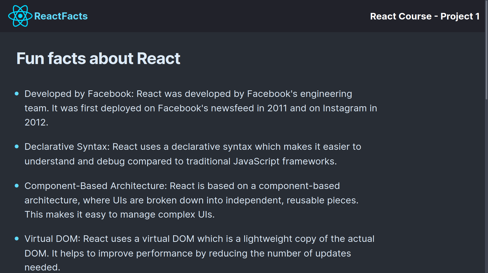

# React Facts Explorer

Explore a small collection of interesting facts about React.js with this simple
web application built using React and Vite.

## Preview

## What I learned

In the course of building this application, I delved into the fundamentals of
React, mastering essential concepts such as component creation and lifecycle
methods. Moreover, I gained hands-on experience in deploying React projects to
GitHub Pages.

## Acknowledgments

Special thanks to the following resources for their contributions to this
project:

- [React Course](https://youtube.com/watch?v=bMknfKXIFA8)
- [Google Webfonts Helper](https://gwfh.mranftl.com/fonts)
