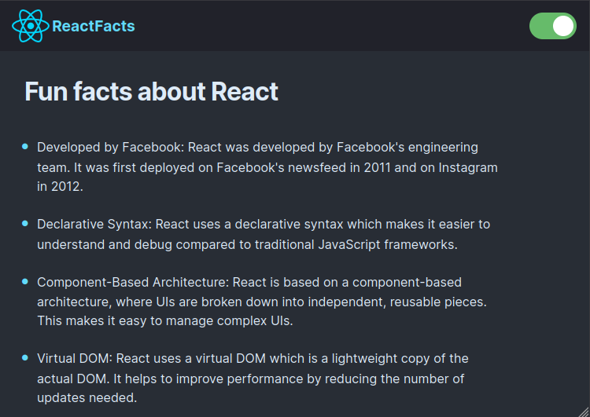

# React Facts Explorer

Explore a small collection of interesting facts about React.js with this simple
web application built using React and Vite. This project was created as part of
a [React course](https://youtube.com/watch?v=bMknfKXIFA8) to enhance learning
and understanding of React fundamentals.

## Preview

## Acknowledgments

Special thanks to the following resources for their contributions to this
project:

- [Google Webfonts Helper](https://gwfh.mranftl.com/fonts)
